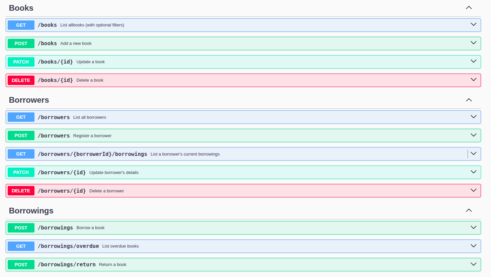
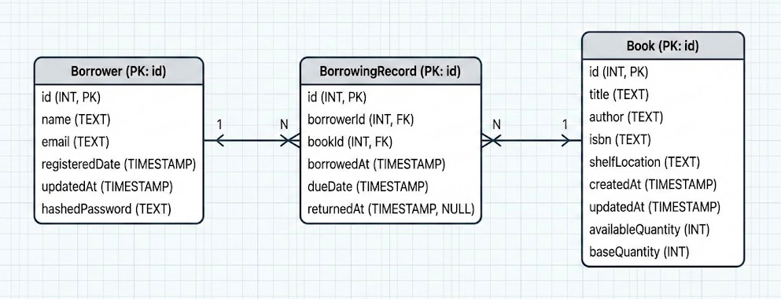

# Library API

A backend API for library management, handling books, borrowers, and borrowing records.

## 🛠 Tech Stack
- **Framework:** Express.js
- **Database:** PostgreSQL
- **ORM:** Prisma
- **Documentation:** Swagger

## ✅ Prerequisites

- [Docker Desktop](https://docs.docker.com/get-docker/) installed and running.

## 🚀 Setup & Installation

### 1. Clone the repository
```bash
git clone https://github.com/hosain-ghoraba/Library-API
cd Library-API
```

### 2. Configure Environment

Create a `.env` file in the project root and copy the contents of `.env.example` into it.

```bash
cp .env.example .env
```

### 3. Run with Docker

Start the application and database containers:

```bash
docker compose up --build -d
```

### 4. Run Migrations

Apply the database schema:

```bash
docker compose exec app npx prisma migrate deploy
```

### 5. Seed the Database (Optional)

**Warning:** This will clear the database and repopulate it with mock data.

```bash
docker compose exec app npx prisma db seed
```

---

## 📖 API Documentation

* The full API documentation is available locally after starting the server at:
👉 **[http://localhost:3000/api-docs](http://localhost:3000/api-docs)** , below is a quick screenshot of it. 


### Database Schema (ERD)




## 🔮 Future Improvements

* **Pagination:** Implement pagination for GET endpoints that (list all resources).
* **Security:** Add authentication & rate limiting.
* **Testing:** Add unit and integration tests.

## 📝 Notes for Reviewers

* **Code Comments:** There are some noteworthy comments for the Bosta team. You can find them by searching for the text: *"for Bosta supervisor"* in the codebase using your IDE search.
* **Seeding:** The seeder is AI generated, it works anyway.
